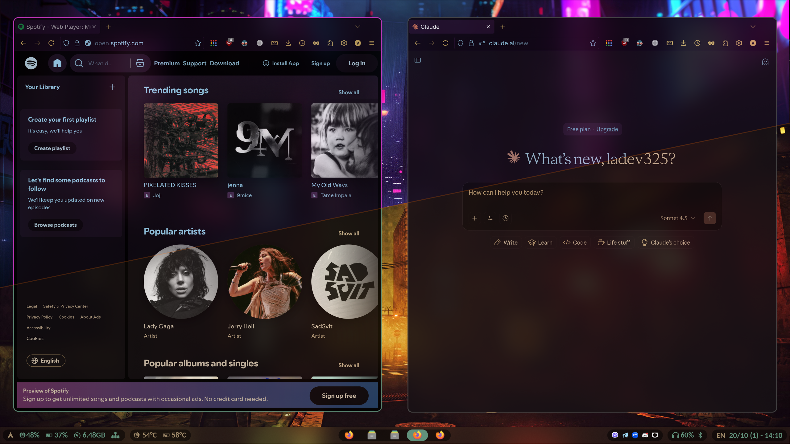

<div align="center">

<a href="https://git.io/typing-svg">

</a>

### *"If you can change something, SINGLE-STYLE IT"*


</div>
<br>
<div align="center">

## The following things were themed with Pywal script to match a single system style:
|Application|
|-------------|
| Hyprland |
| All GTK/Libadwaita apps |
| All Qt apps |
| Kitty |
| Firefox |
| Dark Reader (Firefox extension) |
| VS Code |
| Discord |
| Telegram |
| Rofi (launcher, powermenu, wall selector) |
| Waybar |
| Dunst |
| Filemanager icons |

</div>
<br>
<div align="center">

## 🖼️ Gallery
| | |
|:---:|:---:|
|  |  |
|  |  |

<details>
<summary>More</summary>

| | |
|:---:|:---:|
|  |  |
|  |  |
|  |  |
|  |  |
|  |  |
|  |  |
|  |  |
|  |  |
|  |  |


</details>
<br>
</div>

<div align="center">

## 📦 Packages used for theming
| Package | Description |
|:-----------:|:------------:|
| Pywal | Main color generator (+ custom templates) |
| Rofi | Wallpaper selector |
| Nwg-look | Applying GTK/Libadwaita themes generated by gradience |
| Gradience | Pywal GTK theme generator |
| Kvantum-manager | Themes all Qt apps |
| Pywalfox | Themes Firefox menus |
| Pywal-darkreader | Themes the entire Internet (kinda cool) |
| Pywal-discord | Themes Discord |
| Walogram | Themes Telegram |
| Catppucin-papirus-folders | Themes file manager icons (any filemanager, I use thunar) |

</div>
<br>
<div align="center">

## 🚀 Install guide

</div>

> [!CAUTION]
> - This guide is intended for those who understand what they're doing<br>
> - This is not a fully complete guide on installing everything, just a list of how to work with these configs<br>
> - I am not able to provide a fresh list of the packages I could possibly use and download as some of them can change over time etc, BUT I'll tell what you basically need to get the setup like this<br>
> - You'll 100% need to fix, additionally download or google something that is not working due to the repo possibly becoming outdated (though I'll try to maintain it as long as I use the dotfiles)<br>
> - Author is not responsible for any system breaks caused by these configs<br>
> - User discretion is advised
> ### *Make sure to backup your existing configs before setting up these, there's no plan B to restore them later*

Also read all the points below before doing anything

#### 1. Clone or download this repository
#### 2. Copy everything from `/Configs/.config` to your `/home/.config` directory
- You should also backup and delete your configs in order to avoid possible conflicts<br>
- This repo is minimally scripted, so you can easily copy only certain things<br>
#### 3. Copy everything from `/.mozilla/firefox/YOUR_PROFILE_NAME/chrome` to the according folder in your system
- It is needed for Firefox logo customization<br>
- If you have multiple profile folders in `/firefox`, you can try copying to both sequentially to find the active one<br>
- Skip the step if you don't need to customize your Firefox logo<br>
> [!IMPORTANT]
> You'll have to go to about:config and set «toolkit.legacyUserProfileCustomizations.stylesheets» to "true"
#### 4. Copy `.zshrc` to `/home/.zshrc`
#### 5. Add your own .jpg wallpapers (as many as you want) to `/.config/wallpapers/images`
- Also you can delete that cat saying "only jpgs are supported.png" (he's not lying btw)
#### 6. Install the following packages:
```bash
# Official repo (pacman) packages
sudo pacman -S adw-gtk-theme
sudo pacman -S archlinux-xdg-menu
sudo pacman -S ark
sudo pacman -S blueman
sudo pacman -S bluez-utils
sudo pacman -S btop
sudo pacman -S cava
sudo pacman -S cliphist
sudo pacman -S cool-retro-term
sudo pacman -S discord
sudo pacman -S dunst
sudo pacman -S efibootmgr
sudo pacman -S fastfetch
sudo pacman -S firefox
sudo pacman -S gnome-calculator
sudo pacman -S gnome-sound-recorder
sudo pacman -S gsimplecal
sudo pacman -S gvfs
sudo pacman -S hyprland
sudo pacman -S hyprshot
sudo pacman -S hyprsunset
sudo pacman -S kitty
sudo pacman -S kvantum
sudo pacman -S kvantum-qt5
sudo pacman -S libdvdcss
sudo pacman -S mousepad
sudo pacman -S nano
sudo pacman -S network-manager-applet
sudo pacman -S networkmanager
sudo pacman -S nm-connection-editor
sudo pacman -S nodejs
sudo pacman -S noto-fonts
sudo pacman -S noto-fonts-cjk
sudo pacman -S noto-fonts-emoji
sudo pacman -S nwg-look
sudo pacman -S obs-studio
sudo pacman -S papers
sudo pacman -S pavucontrol
sudo pacman -S polkit-gnome
sudo pacman -S qt5-wayland
sudo pacman -S qt5ct
sudo pacman -S qt6-positioning
sudo pacman -S qt6-virtualkeyboard
sudo pacman -S qt6ct
sudo pacman -S rofi
sudo pacman -S sddm
sudo pacman -S sof-firmware
sudo pacman -S swww
sudo pacman -S telegram-desktop
sudo pacman -S thunar
sudo pacman -S thunar-archive-plugin
sudo pacman -S thunar-volman
sudo pacman -S ttf-firacode-nerd
sudo pacman -S tumbler
sudo pacman -S unrar
sudo pacman -S vlc
sudo pacman -S vlc-plugin-ffmpeg
sudo pacman -S vlc-plugin-x264
sudo pacman -S vlc-plugin-x265
sudo pacman -S waybar
sudo pacman -S xdg-desktop-portal-hyprland
sudo pacman -S ydotool
sudo pacman -S zsh

# AUR packages
yay -S betterdiscord-installer
yay -S gapless
yay -S gradience
yay -S papirus-folders-catppuccin-git
yay -S python-pywalfox
yay -S pywal-discord-git
yay -S pywal-git
yay -S qview
yay -S visual-studio-code-bin
yay -S walogram-git

# Manual installation required
# oh-my-zsh (during the installation you should select the option where it doesn't overwrite your copied .zshc)

# nvidia drivers if needed (check hyprland docs for more info)

```

#### 7. Qt & GTK settings (it might be set already coz of the configs you copied, so it's just to be sure)
```$ qt5ct ```<br>
Set style to "kvantum-dark"<br>
Set icon theme to "Papirus-Dark"<br>

```$ qt6ct ```<br>
Set style to "kvantum-dark"<br>
Set icon theme to "Papirus-Dark"<br>

```$ nwg-look ```<br>
Set theme to "adw-gtk3-dark"<br>

```$ gradience ```<br>
Next, ok, proceed etc<br>
In GUI, toggle GTK 3 and GTK 4 flatpak support if needed

#### 9. Install SDDM theme if you don't have one. You can use [Astronaut theme](https://github.com/Keyitdev/sddm-astronaut-theme)
#### 10. Setup pywal darkreader from [this repo](https://github.com/alexhulbert/SeaGlass)
#### 11. `sudo EDITOR=nano visudo`
- Allow wheel group users to execute any command *without password*
- It is required by icon autochange script
#### 12. Press <kbd>Super</kbd> + <kbd>Alt</kbd> + <kbd>Space</kbd> and apply the wallpaper you need 
- This will sync all the templates with the theming tools you just installed
#### 13. Install BetterDiscord
- Then, apply pywal theme generated by pywal-discord in discord theme settings (pywal-discord-new.css, not the default one!)
#### 14. Choose /.cache/walogram/wal.tdesktop-theme in telegram settings
- After wallpaper change it reloads on full telegram close, but sometimes automatically🤔
#### 15. Go to pywalfox settings in Firefox
> Expand the "theme template" bar and configure colors according to the screenshot:


<br>

> [!NOTE]
> - The scripts provided here change your VSCode settings.json in order to apply pywal theme
> - This does not override syntax highlighting, so you can install any from extension manager
> - If you want to keep the default theme, comment the string that launches 'reload_vscode.sh' in `/.config/wallpapers/scripts/reload_all.sh`
> - If you've already applied the theme, the backup of your original settings.json is stored as settings-backup.json in the same folder

> [!TIP]
> - Youtube escaper script will stop the video, quit fullscreen, mute the sound and switch to another tab
> - *If there are no tabs, nothing happens!*
> - To undo, press <kbd>Super</kbd> + <kbd>Pause</kbd>. This will unmute the sound and return to previous tab
> - Tested in Firefox. Have fun!

<div align="center">

## ⌨️ Keybindings
#### *There are no workspace keybindings, sorry for the inconvenience*😔
### Window Management
| Keybinding | Action |
|:-----------|:-------|
| <kbd>Super</kbd> + <kbd>Q</kbd> | Close active window |
| <kbd>Super</kbd> + <kbd>S</kbd> | Toggle split |
| <kbd>F11</kbd> | Toggle fullscreen |
| <kbd>Super</kbd> + <kbd>W</kbd> | Toggle floating mode |
| <kbd>Super</kbd> + <kbd>←/→/↑/↓</kbd> | Move focus between windows |
| <kbd>Alt</kbd> + <kbd>Tab</kbd> | Cycle through windows |
| <kbd>Super</kbd> + <kbd>LMB</kbd> | Move window |
| <kbd>Super</kbd> + <kbd>Shift</kbd> + <kbd>Ctrl</kbd> + <kbd>←/→/↑/↓</kbd> | Move window in direction |
| <kbd>Super</kbd> + <kbd>RMB</kbd> | Resize window |
| <kbd>Super</kbd> + <kbd>Shift</kbd> + <kbd>←/→/↑/↓</kbd> | Resize window in direction |

### Applications
| Keybinding | Action |
|:-----------|:-------|
| <kbd>Super</kbd> + <kbd>A</kbd> | Open app launcher (Rofi) |
| <kbd>Super</kbd> + <kbd>T</kbd> | Open terminal with ascii fastfetch |
| <kbd>Super</kbd> + <kbd>Shift</kbd> + <kbd>T</kbd> | Open terminal with img fastfetch |
| <kbd>Super</kbd> + <kbd>E</kbd> | Open file manager |
| <kbd>Super</kbd> + <kbd>B</kbd> | Open browser |
| <kbd>Super</kbd> + <kbd>N</kbd> | Open text editor (Mousepad) |
| <kbd>Super</kbd> + <kbd>C</kbd> | Open calculator |
| <kbd>Super</kbd> + <kbd>V</kbd> | Open Viber |
| <kbd>Super</kbd> + <kbd>Shift</kbd> + <kbd>V</kbd> | Open Telegram |
| <kbd>Ctrl</kbd> + <kbd>Shift</kbd> + <kbd>Esc</kbd> | Open system monitor (btop) |

### System Controls
| Keybinding | Action |
|:-----------|:-------|
| <kbd>Super</kbd> + <kbd>Space</kbd> | Switch keyboard layout |
| <kbd>Super</kbd> + <kbd>P</kbd> | Open power menu |
| <kbd>Super</kbd> + <kbd>Shift</kbd> + <kbd>S</kbd> | Take screenshot (region) |
| <kbd>Super</kbd> + <kbd>M</kbd> | Toggle blue light filter |
| <kbd>Super</kbd> + <kbd>O</kbd> | Toggle active window opacity |
| <kbd>Super</kbd> + <kbd>Shift</kbd> + <kbd>O</kbd> | Toggle window opacity |

### Theming & Wallpapers
| Keybinding | Action |
|:-----------|:-------|
| <kbd>Super</kbd> + <kbd>Alt</kbd> + <kbd>Space</kbd> | Open wallpaper selector |
| <kbd>Super</kbd> + <kbd>Alt</kbd> + <kbd>↑</kbd> | Switch to next wallpaper |
| <kbd>Super</kbd> + <kbd>Alt</kbd> + <kbd>↓</kbd> | Switch to previous wallpaper |
| <kbd>Super</kbd> + <kbd>R</kbd> | Reload theme |

### Custom Scripts
| Keybinding | Action |
|:-----------|:-------|
| <kbd>Super</kbd> + <kbd>1</kbd> | Open notes (please set your own path in config!) |
| <kbd>Super</kbd> + <kbd>2</kbd> | Open planners |
| <kbd>Super</kbd> + <kbd>3</kbd> | Open AIs |
| <kbd>Pause</kbd> | YouTube escaper script |
| <kbd>Super</kbd> + <kbd>Pause</kbd> | YouTube escaper reset |
</div>
<div align="center">
  
## 📜 Crediting

</div>

- #### *All file authors are mentioned in those files. If I modify them, I also add my name there*<br>
- #### *If a file is mine only, there are no authors mentioned*<br>
- #### *Just do whatever you want, but make sure to credit the original authors and this repo when publishing*
